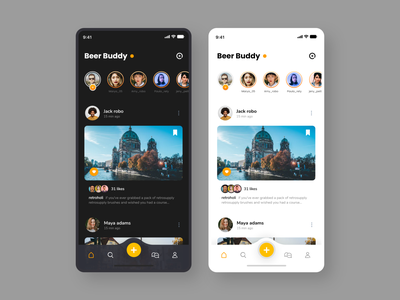

# Insta-Clone

This is an instagram clone made with react native and javascript. It is optimized for both IOS and Andorid. 

## What I had learned?
-React.js
-Node.js
-MongoDB
-JWT Based Authentication
-Deployment on Heroku
-Integrating Email Services - SendGrid

## 🔑 Key Features
-Login / Register using your email
-Follow or unfollow the users
-Like, Comment or Post Images
-Update Profile Image
-Reset Password

